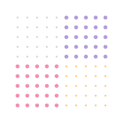

<div align="center">
  
</div>

# Houdini `paint(dot-grid)`

Draw dot-grid backgrounds using [CSS Paint API](https://houdini.glitch.me/paint).

Learn mode about [CSS Houdini](https://houdini.glitch.me/). View [other available worklets](https://houdini.how/).

## Usage

The easiest way to use this worklet is by adding it directly from [unpkg.com](https://unpkg.com/):

```js
CSS.paintWorklet.addModule('https://unpkg.com/houdini-paint-dot-grid/dist/dot-grid-worklet.js');
```

> Check out [houdini.how](https://houdini.how/usage)'s guide on ways to use
> paint worklets from npm and using bundlers.

Then add the following CSS to the element which we want to have the dot-grid
background:

```css
.element-selector {
  background-image: paint(dot-grid);
  --dot-size: 4px;
  --dot-spacing: 8px;
  --dot-color: yellow;
}
```

The worklet already parses the values of the custom properties and define
defaults. To support additional length units for `--dot-size` and
`--dot-spacing` we can optionally load the `dot-grid.js` script which will
register these custom properties:

```html
<!-- ES Modules -->
<script type="module" src="https://unpkg.com/houdini-paint-dot-grid/dist/dot-grid.esm.js"></script>
<script type="module">
  import 'https://unpkg.com/houdini-paint-dot-grid/dist/dot-grid.esm.js';
</script>

<!-- UMD -->
<script src="https://unpkg.com/houdini-paint-dot-grid/dist/dot-grid.umd.js"></script>
```

## API

**`paint(dot-grid)`**

The paint worklet is registered with the name `dot-grid`, and it can be used
anywhere where the CSS expects an image, such as background images, border
images, etc.

These custom properties can be used to customize the appearance of the dot grid:

- **`--dot-size`**: The diameter of the dots. Default: `3px`.
- **`--dot-spacing`**: The space between each dot. Default: `6px`.
- **`--dot-color`**: The color of the dots. Default: `#d2d6db`.

## Polyfill

To use paint worklets in browsers that don't support the Houdini Paint API yet,
we may use the [css-paint-polyfill](https://github.com/GoogleChromeLabs/css-paint-polyfill)
library.

## License

[MIT License](License)
